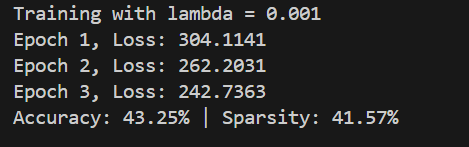
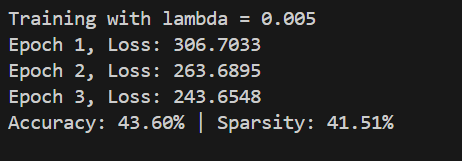
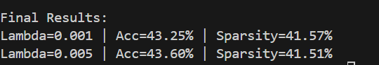

# Self-Pruning Neural Network

This project implements a neural network that learns to prune itself during training using learnable gates and L1 regularization.

---

## Results

- Accuracy: ~43%
- Sparsity: ~41%
- Demonstrates effective self-pruning behavior

---

## Sample Output

---

## Approach

- Each weight is associated with a learnable gate (0 to 1)
- Gates are applied as:

  output = (weight × gate) × input

- L1 regularization is applied on gates to enforce sparsity
- The network learns to remove unimportant weights during training

---

## Tech Stack

- Python
- PyTorch
- CIFAR-10 Dataset

---

## Results Table

| Lambda | Accuracy | Sparsity |
|--------|---------|----------|
| 1e-3   | 43.25%  | 41.57%   |
| 5e-3   | 43.60%  | 41.51%   |

---

## Key Insight

Increasing lambda encourages sparsity (pruning) but may reduce accuracy.  
This demonstrates the trade-off between model efficiency and performance.

---

## Project Structure

- `model.py` → Custom prunable layer  
- `train.py` → Training logic  
- `evaluate.py` → Evaluation metrics  
- `report.md` → Explanation and analysis  

---

## Highlights

- Custom implementation without using nn.Linear  
- Dynamic pruning during training  
- Achieved ~41% sparsity while maintaining ~43% accuracy  
